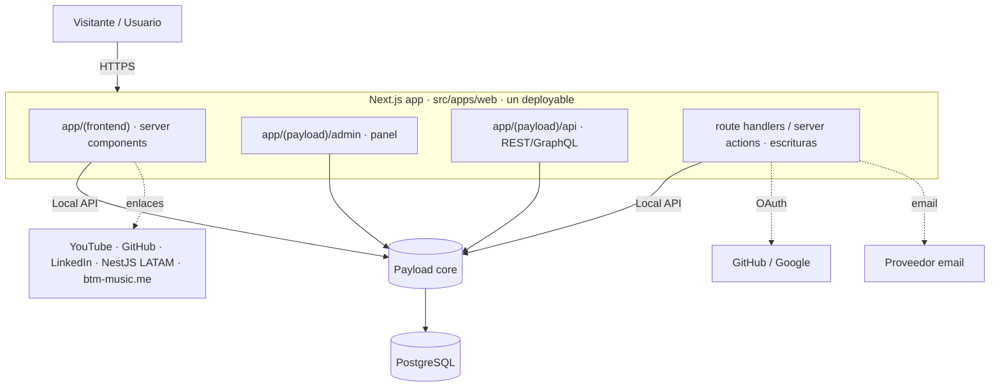
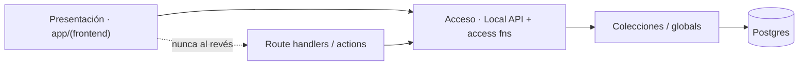

# Architecture Spine — webportal

Brownfield: el repo ya embebe **Payload 3.85.1 + Postgres + Next.js 16.1.6 (App Router) + React 19** con `payload.config.ts` y colecciones `posts`, `comments`, `users`. Este spine **ratifica** lo existente y fija los invariantes que faltan, marcando los **conflictos** entre lo decidido (PRD) y lo sembrado.

## Design Paradigm

**Monolito modular de un solo deployable sobre Next.js App Router con Payload CMS embebido como columna de datos/contenido.**

- **Presentación (público):** Next.js App Router, *server-component-first*. Grupo de rutas `app/(frontend)`.
- **Admin & API de contenido:** Payload, montado en `app/(payload)` (admin panel) y `app/(payload)/api` (REST/GraphQL). Ya presente.
- **Datos:** una sola base **PostgreSQL** vía `@payloadcms/db-postgres`.
- **Acceso a datos:** lectura *server-side* por **Payload Local API**; escrituras (comentarios, leads) por route handlers / server actions validados.
- **Editor de texto rico:** Lexical (`@payloadcms/richtext-lexical`).

Regla del paradigma: **el contenido es dato gobernado por colecciones de Payload; la presentación lee de Payload, nunca de mocks en el repo.**

## Invariants & Rules

### AD-1 — Un solo deployable: Next.js + Payload embebido + un Postgres `[ADOPTED]`
- **Binds:** all
- **Prevents:** segundo runtime/stack (PHP/servicio aparte), drift frontend↔backend, dos bases de datos.
- **Rule:** todo corre en la app Next.js (`src/apps/web`) con Payload embebido y una única Postgres. No se introduce backend separado.

### AD-2 — El contenido vive como colecciones/globals de Payload (única fuente de verdad) `[ADOPTED]`
- **Binds:** Catálogo (Product), Posts, Recursos (Resource), Casos (Case), Servicios (Service), Home/Nav/Social (globals).
- **Prevents:** catálogos hardcodeados (estilo `productsMock.ts` del viejo `beyondnet-portal`), contenido duplicado fuera del CMS.
- **Rule:** cada tipo de contenido es una colección o global de Payload; la presentación lo consume desde Payload. Migrar el mock del portal viejo a la colección `products`.

### AD-3 — Autorización por funciones de acceso de Payload, role-gated, default-deny en escritura `[ADOPTED]`
- **Binds:** todas las colecciones.
- **Prevents:** endpoints sin control, escritura pública accidental.
- **Rule:** cada colección declara `access`; `read` público solo donde es intencional; `create/update/delete` siempre role-gated. (Ratifica el patrón ya usado en `posts`/`comments`/`users`.)

### AD-4 — Dos clases de identidad: *staff* vs *comentaristas* `[DECIDIDO]`
- **Binds:** Users, Members, Comments, Auth (FR-13, FR-16, FR-17, FR-18).
- **Prevents:** que un comentarista obtenga acceso al admin; mezclar cuentas de personal con públicas.
- **Rule:** **staff** = colección `users` (roles `admin|author|moderator`, auth email de Payload, único con acceso al admin panel). **Comentaristas** = colección `members`, login **GitHub + Google + email** vía **Auth.js (`payload-authjs`)**. Los `members` nunca acceden al admin.
- **Pendiente de código (historia de Rebanada 3):** el repo aún no tiene OAuth ni `members`.

### AD-5 — Integridad del comentario: autoría autenticada + moderación previa `[DECIDIDO]`
- **Binds:** Comments (FR-13, FR-14, FR-15).
- **Prevents:** suplantación de autoría y spam anónimo.
- **Rule:** un Comment **referencia a un `member` autenticado** (relación), no un `authorName` de texto libre; `create` exige sesión válida; nace `status=pending`; invisible hasta aprobación por `moderator|admin`.
- **Pendiente de código (historia de Rebanada 3):** hoy `comments.create: () => true` + `authorName` libre → corregir.

### AD-6 — Lectura server-first por Local API; escrituras validadas y con rate-limit
- **Binds:** todo acceso a datos (FR-11, FR-12, FR-13, FR-22).
- **Prevents:** sobre-fetch desde el cliente, exposición de acceso de escritura, fugas de datos privados.
- **Rule:** páginas públicas leen vía Payload **Local API** en server components; mutaciones (comentarios, leads) van por route handlers/server actions con validación de entrada y **rate-limit** (login y comentarios).

### AD-7 — i18n por campos localizados; ES por defecto, fallback ES
- **Binds:** todas las colecciones de contenido (FR-20).
- **Prevents:** contenido a medio traducir o claves de idioma divergentes.
- **Rule:** habilitar `localization` en Payload con locales `es` (default) y `en`; campos editoriales localizados; fallback a `es` si falta `en`.

### AD-8 — Valores de enumeración canónicos en inglés + labels localizados `[DECIDIDO]`
- **Binds:** todos los campos `select` (status, role, type…).
- **Prevents:** la mezcla actual `draft/published` (posts, inglés) vs `pendiente/aprobado` (comments, español) vs `autor/moderador` (users, español).
- **Rule:** el `value` almacenado va en **inglés y estable** (`pending|approved`, `draft|published`, `author|moderator|admin`); el `label` se localiza para la UI.
- **Pendiente de código (historia):** alinear `comments` (`pendiente/aprobado`→`pending/approved`) y `users` (`autor/moderador`→`author/moderator`).

### AD-9 — Leads persistidos + notificados, con anti-spam `[DECIDIDO]`
- **Binds:** Conversión/Contacto (FR-22).
- **Prevents:** leads perdidos y formularios spameados.
- **Rule:** los envíos se guardan en colección `leads` (con `intent`) **y** se notifican por email vía **Resend**; **Cloudflare Turnstile** + honeypot + rate-limit obligatorios.

### AD-10 — SEO obligatorio en rutas públicas; admin/api no indexables `[DECIDIDO]`
- **Binds:** todas las superficies públicas (FR-21).
- **Prevents:** un canal de marketing invisible a buscadores.
- **Rule:** cada ruta pública emite `metadata` (title/description/canonical) + Open Graph; `sitemap.xml` + `robots.txt`; `app/(payload)` y `/api` marcadas `noindex`. Analítica de conversión con **Plausible**.

### AD-11 — Configuración y secretos por entorno `[ADOPTED]`
- **Binds:** all.
- **Prevents:** secretos en el repo.
- **Rule:** `PAYLOAD_SECRET`, `DATABASE_URI` y credenciales OAuth/email vienen de variables de entorno (ya en uso). Nada de secretos versionados.

### AD-12 — Despliegue: un servicio Node + Postgres `[ASSUMPTION]`
- **Binds:** operación.
- **Prevents:** suposiciones divergentes de despliegue.
- **Rule:** build con Nx; un proceso Node (Next standalone) + Postgres gestionado. Objetivo **Hostinger VPS**; confirmar runtime/Node 20+ que exige Next 16.

## Consistency Conventions

| Concern | Convention |
| --- | --- |
| Slugs de colección | minúscula plural en inglés (`posts`, `comments`, `users`, `products`, `resources`, `cases`, `services`, `members`, `leads`). |
| Nombres de campo | inglés camelCase (`title`, `content`, `author`, `status`, `publishedAt`). |
| Valores de `select` | `value` en inglés estable; `label` localizado (AD-8). |
| Fechas / ids | ISO 8601 para fechas; ids de Payload por defecto. |
| Texto rico | Lexical (`@payloadcms/richtext-lexical`) en todo el contenido enriquecido. |
| Auth / authz | funciones `access` por colección; default-deny en escritura (AD-3). |
| Acceso a datos | lectura server-first vía Local API; escritura por route handlers validados (AD-6). |
| i18n | locales `es`(default)/`en`; campos localizados; fallback `es` (AD-7). |
| Config | variables de entorno; sin secretos en repo (AD-11). |

## Stack

*Verificado actual a la fecha (jun 2026): Payload 3.x estable y nativo de Next.js App Router; Next.js 16.2.x es la línea estable actual (16.2.9 LTS) — el repo está en 16.1.6; Payload 3 es compatible con Next 16. Payload 4 aún no estable → permanecer en 3.x.*

| Name | Version |
| --- | --- |
| Next.js | ~16.1.6 (LTS actual 16.2.9 — evaluar upgrade menor) |
| React / React DOM | ^19.0.0 |
| Payload | ^3.85.1 |
| @payloadcms/db-postgres | ^3.85.1 |
| @payloadcms/next | ^3.85.1 |
| @payloadcms/richtext-lexical | ^3.85.1 |
| PostgreSQL | gestionada (versión por fijar en deploy) |
| Nx | ^22.7.6 |
| TypeScript | ~5.9.2 |
| Auth.js (NextAuth) | vía `payload-authjs` (GitHub/Google/credenciales) |
| Email transaccional | Resend |
| Anti-spam | Cloudflare Turnstile (+ honeypot) |
| Analítica | Plausible |

## Structural Seed

### Container view



### Dependency direction (quién puede depender de quién)



### Core entities (ERD)

```mermaid
erDiagram
  USER ||--o{ POST : "autor (staff)"
  MEMBER ||--o{ COMMENT : "escribe"
  POST ||--o{ COMMENT : "recibe"
  PRODUCT ||--o{ RESOURCE : "agrupa"
  USER { string email; enum role }
  MEMBER { string email; enum provider }
  POST { string title; richtext content; enum status }
  COMMENT { text content; enum status }
  PRODUCT { string name; enum type }
  RESOURCE { string title; enum type; locale lang }
  CASE { string title; string client }
  SERVICE { string name; enum kind }
  LEAD { enum intent; json payload }
```

### Source tree (seed)

```text
src/apps/web/src/
  app/
    (frontend)/        # rutas públicas (home, products, services, portfolio, resources, blog, community, contact)
    (payload)/         # admin + api de Payload (ya presente)
    api/               # route handlers propios (comments, leads, auth callbacks)
  collections/         # users, posts, comments (+ nuevas: products, resources, cases, services, members, leads)
  globals/             # home, nav, socialLinks, siteSettings
  payload.config.ts    # buildConfig (ya presente)
```

## Capability → Architecture Map

| Capability / Área (FR) | Lives in | Governed by |
| --- | --- | --- |
| Home/Vitrina (FR-1..3) | `app/(frontend)/` + global `home` | AD-2, AD-6, AD-10 |
| Catálogo de Productos (FR-4,5) | colección `products` | AD-2, AD-3 |
| Servicios (FR-6) | colección `services` | AD-2 |
| Portafolio/Casos (FR-7) | colección `cases` | AD-2 |
| Comunidad (FR-8) | global `socialLinks`/`nav` (enlace) | AD-2 |
| Recursos (FR-9,10) | colección `resources` | AD-2, AD-7 |
| Blog (FR-11,12) | colección `posts` | AD-2, AD-6, AD-7, AD-10 |
| Comentarios + Moderación (FR-13..15) | colección `comments` | AD-3, AD-5, AD-6 |
| Auth comentar (FR-16,17) | colección `members` + OAuth | AD-4, AD-6 |
| CMS/Admin (FR-18,19) | Payload admin `app/(payload)` | AD-2, AD-3 |
| i18n (FR-20) | `localization` Payload | AD-7, AD-8 |
| SEO (FR-21) | metadata + sitemap/robots | AD-10 |
| Conversión/Contacto (FR-22) | colección `leads` + route handler | AD-6, AD-9 |
| Enlaces sociales (FR-23) | global `socialLinks` | AD-2 |

## Deferred

- **Librería OAuth concreta** para `members` (GitHub/Google): elegir e integrar (bloquea Rebanada 3). → Open Question 1.
- **Recursos *gated*** / captura de lead por recurso → Fase 2 (reutiliza `members`).
- **Auto-import YouTube / feeds de redes** → Fase 2.
- **Flywheel Blog → `linkedin-publisher` → LinkedIn** (automatización) → Fase 2.
- **Dogfooding de UMS como IdP** → Visión (reemplazaría AD-4 cuando madure).
- **Demos embebidas (sandbox Tracker), marketplace de rulesets, certificación** → Visión.
- **Versión exacta de Postgres y topología de Hostinger** → decisión de deploy (AD-12).
- **Upgrade Next.js 16.1.6 → 16.2.x LTS** → **post-v1, antes del lanzamiento** (decidido).

## Open Questions

*Resueltas: AD-4 (Auth.js + `members`), AD-5 (corregir comentarios anónimos), AD-8 (enums en inglés), proveedores (Resend/Turnstile/Plausible), timing de upgrade Next (post-v1). Quedan:*

1. **Despliegue (AD-12):** versión exacta de Postgres, topología en Hostinger VPS (Node 20+, proceso, backups, dominios). A definir en deploy.
2. **Alineación del PRD:** reflejar en el glosario del PRD el rol `author`+`moderator` (= "Editor") y los términos nuevos `member` y `lead`. *(Lo aplico a continuación.)*
